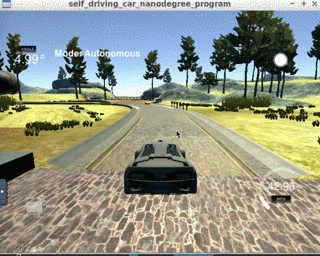

# CarND-Controls-PID
Self-Driving Car Engineer Nanodegree Program



---
## Goal
The goal of this project is to implement a PID controller in C++ to control the steering wheel angle of the car such that it is able to drive along the track in the simulator.

## PID Control
Sensor measurements regarding the cars position is compared to the position of the desired position, upon which the cross-track-error is derived.
The cross-track error (cte) is fed into a PID control loop in order to calculate the necessary control output (the steering wheel angle) that is required to minimize this error.

**P component**: The proportional component. If the error was `cte` then a controller consisting only of a proportional component would try to correct the error by applying a control signal of `Kp * cte`.

**D component**: Using only a P controller causes the control variable to overshoot the desired set-point. A derivative component which controlling the cte's rate of change can be integrated to counteract the overshooting. This is done by adding a term of `Ki * (cte - prev_cte)`, where `prev_cte` is the error of the previous timestep.

**I component**: Using only a PD controller induces a non-zero steady state error (meaning the desired set-point is never reached). To mitigate this an integral component of `Ki * sum(cte)` is added to the control output in order to eliminate the steady state bias (where `sum(cte)` is the sum of all previous errors).

### Implementation
The implementation of the PID controller is done in the `PID.cpp` and `PID.h` file.

In the `PID::UpdateError()` function the P, I and D error terms are computed based on the cte. Then in the `PID::TotalError()` function the control output is calculated as the sum of the individual control terms.

```double output = -Kp * p_error - Kd * d_error - Ki * i_error;```

For the steering wheel controller the control signal is also limited (as per the instructions) to a range of -1 to 1.

The controller is then instantiated in the `main.cpp`. The control output is passed to the `msgJson["steering_angle"]` field which is then sent to the simulator.

### Tuning
In this project the control parameters `Kp, Ki, Kd` are tuned manually according to instructions which I have found online.


The main steps are to first tune Kp (setting `Ki = 0, Kd = 0`). Then the differential portion was added to it until the car was able to drive around the track (with a slight offset to the center). Finally I added the integral component to the controller.

The final parameters that I have found to work were:

```Kp = 0.13, Ki = 0.0001, Kd = 1.8```.

There are many other ways to tune the controller (Twiddle, Ziegler-Nichols) which can be further explored. 

## Speed controller
In addition I have also implemented a speed controller. For this I'm setting a target speed based on the steering wheel error. If the absolute value of this error is low, the target speed is set to a higher speed such as 45mph, otherwise it is set to a low value.

The controller parameters for the speed controller are tuned according to the approach described in the previous section and are set to:

```Kp = -0.2, Ki = 0, Kd = -0.022```

## Observations
With the tuned controllers the vehicle is able to complete the lap with an average speed of about 42-43 mph while staying on track. At higher speeds it still shows some slight swinging motion which can probably be mitigated by more careful parameter tuning.

Interestingly when running the simulator on my local machine (macOS) the controller parameters were vastly different. For example if my Kp was even a tiny fraction higher than 0.00004 the car would immediately overshoot the steering and drive off-track. I suspect that there are a number of factors such as the machine/server specifications which influence how the controller works.

## Dependencies

* cmake >= 3.5
 * All OSes: [click here for installation instructions](https://cmake.org/install/)
* make >= 4.1(mac, linux), 3.81(Windows)
  * Linux: make is installed by default on most Linux distros
  * Mac: [install Xcode command line tools to get make](https://developer.apple.com/xcode/features/)
  * Windows: [Click here for installation instructions](http://gnuwin32.sourceforge.net/packages/make.htm)
* gcc/g++ >= 5.4
  * Linux: gcc / g++ is installed by default on most Linux distros
  * Mac: same deal as make - [install Xcode command line tools]((https://developer.apple.com/xcode/features/)
  * Windows: recommend using [MinGW](http://www.mingw.org/)
* [uWebSockets](https://github.com/uWebSockets/uWebSockets)
  * Run either `./install-mac.sh` or `./install-ubuntu.sh`.
  * If you install from source, checkout to commit `e94b6e1`, i.e.
    ```
    git clone https://github.com/uWebSockets/uWebSockets 
    cd uWebSockets
    git checkout e94b6e1
    ```
    Some function signatures have changed in v0.14.x. See [this PR](https://github.com/udacity/CarND-MPC-Project/pull/3) for more details.
* Simulator. You can download these from the [project intro page](https://github.com/udacity/self-driving-car-sim/releases) in the classroom.

Fellow students have put together a guide to Windows set-up for the project [here](https://s3-us-west-1.amazonaws.com/udacity-selfdrivingcar/files/Kidnapped_Vehicle_Windows_Setup.pdf) if the environment you have set up for the Sensor Fusion projects does not work for this project. There's also an experimental patch for windows in this [PR](https://github.com/udacity/CarND-PID-Control-Project/pull/3).

## Basic Build Instructions

1. Clone this repo.
2. Make a build directory: `mkdir build && cd build`
3. Compile: `cmake .. && make`
4. Run it: `./pid`. 

Tips for setting up your environment can be found [here](https://classroom.udacity.com/nanodegrees/nd013/parts/40f38239-66b6-46ec-ae68-03afd8a601c8/modules/0949fca6-b379-42af-a919-ee50aa304e6a/lessons/f758c44c-5e40-4e01-93b5-1a82aa4e044f/concepts/23d376c7-0195-4276-bdf0-e02f1f3c665d)

